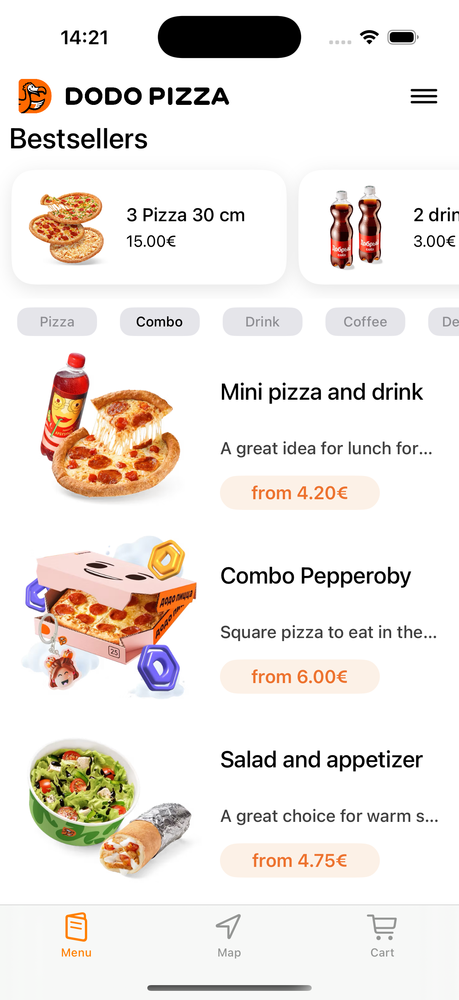
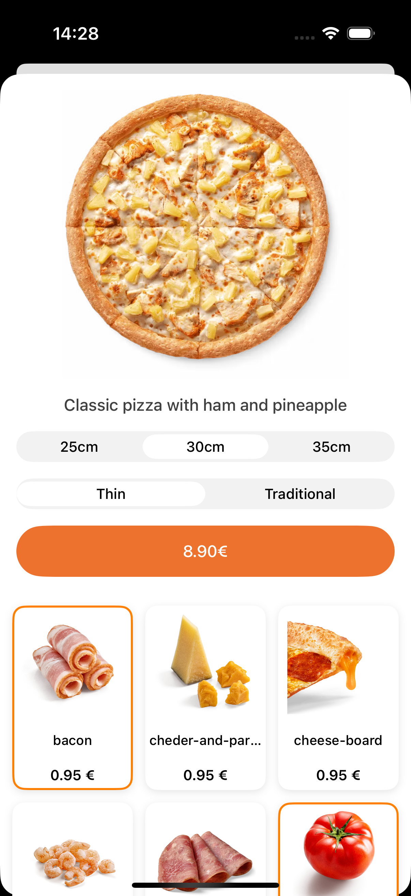
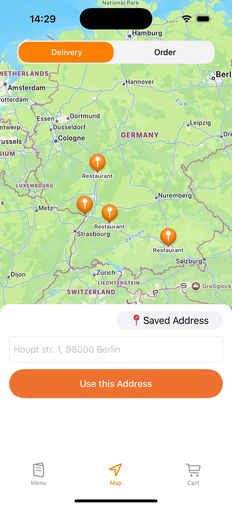
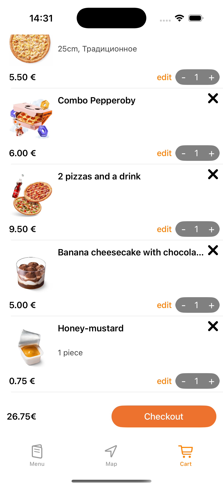

# Dodo Pizza iOS Clone 🍕

[](https://swift.org)
[](https://developer.apple.com/documentation/uikit)


A fully functional iOS clone of the Dodo Pizza web interface, built using native Apple technologies.

---

## 📱 About The Project

This application replicates the core functionality of the Dodo Pizza web interface, providing users with a convenient way to order pizza and other products. The project demonstrates proficiency with modern iOS development technologies.

> ⚠️ Status: **Work in progress** — the delivery map and user menu are still under development.

---

## 🛠 Technologies Used

- **Swift** — primary development language  
- **UIKit** — view controllers & programmatic UI  
- **SnapKit** — DSL for Auto Layout  
- **MapKit** — maps & location services  
- **URLSession** — network requests & API communication

---

## ✨ Features

- 🎨 Adaptive user interface
- 🗺 Delivery address selection on **MapKit**
- 📦 Pizza ordering workflow
- 🔄 Network communication with API
- 🎯 Modern Auto Layout using **SnapKit**
- 📍 Location-based services
- 🛒 Shopping cart functionality

---

## 📸 Screenshots

> Помести изображения по путям `./Screenshots/main_screen.png`, `./Screenshots/pizza_menu.png`, `./Screenshots/delivery_map.png`, `./Screenshots/cart.png`.  
> Обрати внимание на **регистр** папки/файлов: `Screenshots` ≠ `screenshots`.

<div align="center">
  
  
</div>
<br/>
<div align="center">
  
  
</div>

---

## 🚀 Installation & Setup

```bash
# Clone the repository
git clone https://github.com/your-username/dodo-pizza-ios-clone.git
cd dodo-pizza-ios-clone

# Open the project
open DodoPizza.xcodeproj   # или .xcworkspace, если используешь CocoaPods

# (Optional) Install pods
# pod install

# Run in Simulator or on a device
# ⌘ + R

── App
   │   ├── AppDelegate.swift
   │   └── SceneDelegate.swift
   ├── Base.lproj
   │   └── LaunchScreen.storyboard
   ├── Components
   │   ├── BannerCell
   │   ├── BannerLabelView.swift
   │   ├── Collection Views
   │   ├── DitailSegmentControl.swift
   │   ├── Fabrics
   │   ├── QuantityControll.swift
   │   ├── Table Views
   │   └── TopBarCell.swift
   ├── DI
   │   ├── DependencyContainer.swift
   │   └── RootTabBarController.swift
   ├── Extensions
   │   ├── UICollectionView
   │   └── UITableView
   ├── Models
   │   ├── Mappers
   │   ├── ResponseModel
   │   └── ViewModel
   ├── Modules
   │   ├── Cart
   │   ├── Details
   │   ├── Map
   │   └── Menu
   ├── Network
   │   ├── APIEndpoint.swift
   │   ├── NetworkConstants.swift
   │   └── NetworkError.swift
   ├── Resources
   │   ├── AppColor.swift
   │   ├── Base.lproj
   │   └── Layout.swift
   └── Services
       ├── Base.lproj
       ├── CartUserDefaultsService.swift
       ├── GeocodingService.swift
       └── Loaders
